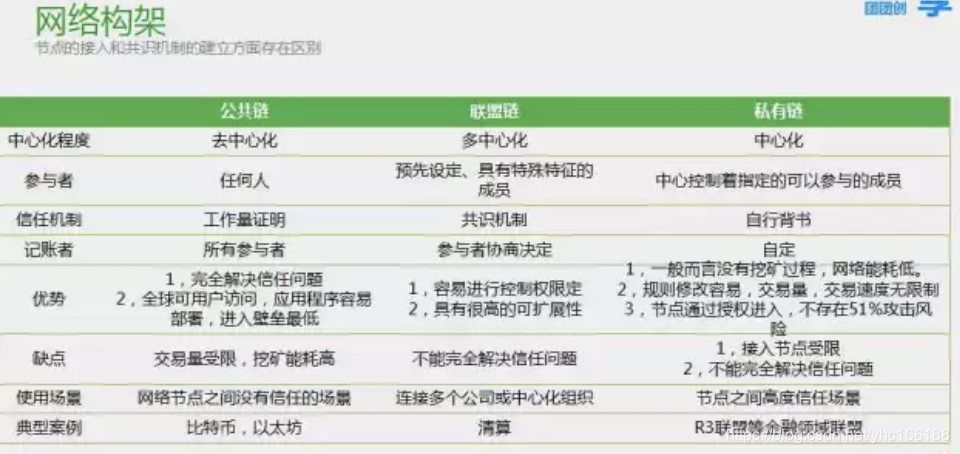

## 区块链基础

### 区块链定义

区块链是一个分布式账本，一种通过去中心化，去信任的方式集体维护一个可靠数据库的技术方案

[《区块链详细定义》](https://blog.csdn.net/yhc166188/article/details/103949288)

[《区块链概述》](https://blog.csdn.net/yhc166188/article/details/79584353)

### 区块链的特征

1. 开发，共识
2. 去中心去信任
3. 交易通明，双方匿名
4. 不可篡改，可追溯

### 分类

公有链，联盟链，私有链

## 一、共识机制、共识算法

### 1、什么是共识机制?

我们都知道，区块链可以看作一本记录所有交易的分布式公开帐簿，区块链网络中的每个参与者都把它看作一本所有权的权威记录。

公开账本历史数据不可篡改，只允许往后添加，每个节点都具有相同的权限，那么就带来一个问题：

公开账本每个新区块由谁来负责写入？

因为所有节点都一样，如果所有节点同时一起写入账本数据，那么肯定数据会不一致。

因此需要一种机制来保证区块链中的每一区块只能由一个节点来负责写入，如何选出写入账本数据的节点，这就是共识机制。让平等的参与者按照某种秩序达成一致意见。

打个比方，

现在有一个中心数据库，所有客户端都能来查询，每个客户端权限都是一样，但如果要对数据库进行增删改，不好意思，每次只允许一个客户端来操作，通俗讲，就是让数据库串行修改数据库。通过一个算法机制来抉择出操作的客户端。这个机制就是共识机制，所谓的共识就是在人人平等的社会里需要大家共同形成一个共识，产生一个操作者、临时决策者，代表大家来进行中心化的操作，大家按照这个共识来维持去中心化的网络世界。

### 2、主流的共识算法有哪些？

区块链中的共识算法说到底还是分布式系统中最重要的一致性问题：

在分布式网络中如何保证数据一致性。

说到一致性问题，就不得不提大名鼎鼎的拜占庭将军问题。是 Leslie Lamport 1982 年提出用来解释一致性问题的一个虚构模型。拜占庭是古代东罗马帝国的首都，由于地域宽广，守卫边境的多个将军（系统中的多个节点）需要通过信使来传递消息，达成某些一致的决定。但由于将军中可能存在叛徒（系统中节点出错），这些叛徒将努力向不同的将军发送不同的消息，试图会干扰一致性的达成。

具体详情内容可执行google，我这里只说结论：

Leslie Lamport 证明，当叛变者不超过1/3时，存在有效的算法，不论叛变者如何折腾，忠诚的将军们总能达成一致的结果。如果叛变者过多，则无法保证一定能达到一致性。

对于拜占庭将军问题分两种情况：

1）针对非拜占庭错误的情况，一般包括 Paxos、Raft 及其变种。

分布式数据库设计一般都是基于paxos或raft算法。

对于paxos原理，可参考我之前写的一篇文章：

[《理解这两点，也就理解了paxos协议的精髓》](https://zhuanlan.zhihu.com/p/29706905)

数据库基本采用raft和paxos的变种：

百度最近刚刚开源了：百度正式开源其Raft一致性算法实现braft http://www.infoq.com/cn/news/2018/03/Baidu-open-source-Raft-algorithm

AliSQL X-Cluster基于X-Paxos的高性能强一致MySQL数据库 http://tech.it168.com/a2017/0803/3159/000003159063.shtml

微信开源：生产级paxos类库PhxPaxos实现原理介绍 http://www.infoq.com/cn/articles/weinxin-open-source-paxos-phxpaxos

阿里云新一代关系型数据库 PolarDB 剖析 采用分布式Raft协议来保证数据的强一致性，拥有更加优异的故障恢复时间，更加满足数据容灾备份等业务场景的需求。 http://www.infoq.com/cn/articles/ali-polardb

2）对于要能容忍拜占庭错误的情况，一般包括 PBFT 系列、PoW 系列算法等。

从概率角度，PBFT 系列算法是确定的，一旦达成共识就不可逆转；而 PoW 系列算法则是不确定的，随着时间推移，被推翻的概率越来越小。

具体共识算法介绍：

#### 1）拜占庭共识算法系列PBFT/DBFT机制：

[《PBFT实用拜占庭容错算法详解》](https://blog.csdn.net/yhc166188/article/details/100072191)

DBFT机制，是由权益来选出记账人，然后记账人之间通过拜占庭容错算法来达成共识，这种方式的优点是：

1)专业化的记账人；

2)可以容忍任何类型的错误；

3)记账由多人协同完成，每一个区块都有最终性，不会分叉；

4)算法的可靠性有严格的数学证明；

缺点：

1)当有1/3或以上记账人停止工作后，系统将无法提供服务；

2)当有1/3或以上记账人联合作恶，且其它所有的记账人被恰好分割为两个网络孤岛时，恶意记账人可以使系统出现分叉，但是会留下密码学证据；

对于拜占庭将军问题可自行网上查找资料，很多这里不再赘述。

#### 2）工作量证明PoW

工作量证明，Proof of Work，通过计算来猜测一个数值（nonce），得以解决规定的 hash 问题（来源于 hashcash）。保证在一段时间内，系统中只能出现少数合法提案。

同时，这些少量的合法提案会在网络中进行广播，收到的用户进行验证后会基于它认为的最长链上继续难题的计算。因此，系统中可能出现链的分叉（Fork），但最终会有一条链成为最长的链。

#### 3）权益证明PoS

权益证明，Proof of Stake，2013 年被提出，最早在 Peercoin 系统中被实现，类似现实生活中的股东机制，拥有股份越多的人越容易获取记账权。

典型的过程是通过保证金（代币、资产、名声等具备价值属性的物品即可）来对赌一个合法的块成为新的区块，收益为抵押资本的利息和交易服务费。提供证明的保证金（例如通过转账货币记录）越多，则获得记账权的概率就越大。合法记账者可以获得收益。

PoS 是试图解决在 PoW 中大量资源被浪费的缺点。恶意参与者将存在保证金被罚没的风险，即损失经济利益。

一般的，对于 PoS 来说，需要掌握超过全网 的资源，才有可能左右最终的结果。这个也很容易理解，三个人投票，前两人分别支持一方，这时候，第三方的投票将决定最终结果。

#### 4）授权股权证明机制DPOS

PoS 的改进算法，DPOS与POS原理相似。与POS的主要区别在于节点选举若干代理，由代理人验证和记账。

PoW机制和PoS机制虽然都能有效地解决记账行为的一致性共识问题，但是现有的比特币PoW机制纯粹依赖算力，导致专业从事挖矿的矿工群体似乎已和比特币社区完全分隔，某些矿池的巨大算力俨然成为另一个中心，这与比特币的去中心化思想相冲突。PoS机制虽然考虑到了PoW的不足，但依据权益结余来选择，会导致首富账户的权力更大，有可能支配记账权。

股份授权证明机制( Delegated Proof of Stake，DPoS)的出现正是基于解决PoW机制和PoS机制的这类不足。

#### 5）DAG（有向无环图）

[《五分钟讲明白DAG（有向无环图）的优缺点》](https://blog.csdn.net/yhc166188/article/details/93598247)

#### 6) 一致性共识算法 Paxos(简单拜占庭容错)

[《一致性共识算法 Paxos》](https://blog.csdn.net/yhc166188/article/details/105335590)

#### 7) 一致性共识算法 raft(简单拜占庭容错)

[《一致性共识算法 raft》](https://blog.csdn.net/yhc166188/article/details/105335609)

#### 6）区块链中VRF

[《区块链中VRF的应用及原理解析》](https://blog.csdn.net/shangsongwww/article/details/88813267)

[《对可验证随机函数VRF的简明解释》](https://blog.csdn.net/yhc166188/article/details/94572294)

当然，随着科技的发展，在未来可能还会诞生更好的共识机制。

[《目前主流区块链分别用的是什么共识算法？》](https://zhuanlan.zhihu.com/p/34474913)

## 二、区块链中的密码学技术

[《eos中签名验签流程和eosjs中的加解密原理》](https://blog.csdn.net/yhc166188/article/details/100087071)

[《EOS 数据签名与公匙验证代码用例》](https://blog.csdn.net/yhc166188/article/details/100183720)

[《RSA算法原理（一）》](https://blog.csdn.net/yhc166188/article/details/79662831)

[《rsa加密算法》](https://blog.csdn.net/yhc166188/article/details/79674953)

[《eos交易发送的那一刻，发生了什么： 谈谈交易签名》](https://www.jianshu.com/p/9c2f1066f118)

[《Secp256k1》](https://en.bitcoin.it/wiki/Secp256k1)

[《详解椭圆曲线算法，secp256k1 是如何生成公钥和私钥的？》](https://www.zhihu.com/question/22399196)

## 三、智能合约和solidity编程

[《区块链智能合约》](https://blog.csdn.net/yhc166188/article/details/79692034)

### web assembly (wasm)

[《wasm学习》](https://blog.csdn.net/Pnfy__Shan/article/details/98494865)

[《eos虚拟机相关接口实现》](https://blog.csdn.net/yhc166188/article/details/104870420)

[《虚拟机与智能合约详解与分析》](https://blog.csdn.net/SunnyWed/article/details/81078078#EOS智能合约和虚拟机分析)

[《深入程序编译链接和装载过程》](https://blog.csdn.net/yhc166188/article/details/103648299)

## 四、超级账本Hyperledge

[《超全总结Hyperledger Fabric架构原理》](https://blog.csdn.net/yhc166188/article/details/105110270)

[《hyperledger fabric 之 gossip 协议(共识)》](https://blog.csdn.net/yhc166188/article/details/105133221)

## 共识算法

## 公链相关

### 比特币

[《比特币（bitcoin）概述》](https://blog.csdn.net/yhc166188/article/details/79584793)

[《闪电网络》](https://blog.csdn.net/yhc166188/article/details/88133809)

[《聊一聊最近大火的闪电网络》](https://blog.csdn.net/yhc166188/article/details/88133809)

[《隔离见证》](https://blog.csdn.net/yhc166188/article/details/103696164)

[《【币圈不定期更新的日常】聊一聊比特币为什么要部署隔离验证》](https://www.jianshu.com/p/3f982c2f20bd)

[《要安装闪电网络就必须要有隔离见证吗？》](https://www.jianshu.com/p/af849b0774b8)

[《零知识证明》](https://blog.csdn.net/yhc166188/article/details/103697598)

[《比特币UTXO模型介绍》](https://blog.csdn.net/yhc166188/article/details/93602650)

### EOS

[《EOS代码架构及分析》](https://blog.csdn.net/yhc166188/article/details/105017333)

[《EOS代码架构及分析（一）》](https://blog.csdn.net/yhc166188/article/details/81713193)

[《深入解读EOS源代码之——区块链内核》](https://blog.csdn.net/yhc166188/article/details/94002972)

[《Merkle Proof的作用》](https://fisco-bcos-documentation.readthedocs.io/zh_CN/latest/docs/design/merkle_proof.html)

[《Merkle Tree学习》](https://blog.csdn.net/yhc166188/article/details/89636137)

[《Merkle树与SPV验证》](https://blog.csdn.net/yhc166188/article/details/88638704)

[《EOS存储》](https://blog.csdn.net/yhc166188/article/details/85328401)

[《EOS源码备忘-Push Transaction机制》](https://blog.csdn.net/yhc166188/article/details/85339307)

[《eos cpu_limit》](https://blog.csdn.net/yhc166188/article/details/84862880)

[《解析 deferred_transaction 的原理》](https://blog.csdn.net/yhc166188/article/details/89669467)

[《高级EOS系列 - 第1部分 - 加密哈希》](https://blog.csdn.net/yhc166188/article/details/89477858)

[《高级EOS系列 - 第2部分 - 单例模式》](https://blog.csdn.net/yhc166188/article/details/89486559)

[《高级EOS系列 - 第3部分 - 二级索引》](https://blog.csdn.net/yhc166188/article/details/89486939)

[《高级EOS系列 - 第4部分 - 表的唯一性》](https://blog.csdn.net/yhc166188/article/details/89509451)

[《eos multi_index详解》](https://blog.csdn.net/yhc166188/article/details/82724494)

[《EOS 数据库与持久化 API —— 架构》](https://blog.csdn.net/yhc166188/article/details/81750841)

[《EOS 数据库与持久化 API —— 实战》](https://blog.csdn.net/yhc166188/article/details/81750892)

[《eos INLINE Action 和 eosio.code 使用說明》](https://blog.csdn.net/yhc166188/article/details/85860301)

[《eos 账户名与uint64_t转换(N与name)》](https://blog.csdn.net/yhc166188/article/details/83867306)

[《eos require_auth函数》](https://blog.csdn.net/yhc166188/article/details/83866860)

[《EOS 调试合约之日志打印》](https://blog.csdn.net/yhc166188/article/details/83385634)

[《eosiolib文件解析》](https://blog.csdn.net/yhc166188/article/details/83302704)

[《eos系统合约介绍 eosio.msig (上)》](https://blog.csdn.net/yhc166188/article/details/83025676)

[《eos系统合约提案合约eosio.msig (下)》](https://blog.csdn.net/yhc166188/article/details/83026440)

[《【eos不定期更新的日常】系统合约最近升级了什么？》](https://blog.csdn.net/yhc166188/article/details/83022867)

[《【eos不定期更新的日常】使用require_recipient触发合约动作原理介绍》](https://www.jianshu.com/p/f5da8e3849a4)

[《eos 九个系统账户介绍》](https://blog.csdn.net/yhc166188/article/details/83015949)

[《EOS deferred action与inline action》](https://blog.csdn.net/yhc166188/article/details/83002156)

[《EOS的账户授权和多重签名》](https://blog.csdn.net/yhc166188/article/details/82999046)

[《5行代码帮你梳理EOS.IO的脉络》](https://blog.csdn.net/yhc166188/article/details/82829880)

[《eosio.system合约分析》](https://blog.csdn.net/yhc166188/article/details/82751511)

[《eos主网普通用户发币指南》](https://blog.csdn.net/yhc166188/article/details/82664574)

[《一文看懂eos超级节点》](https://blog.csdn.net/yhc166188/article/details/82592534)

[《EOS多主机多节点环境配置》](https://blog.csdn.net/yhc166188/article/details/82590317)

[《EOS 部署智能合约》](https://blog.csdn.net/yhc166188/article/details/82392537)

[《eos 开发一个记录转账信息的智能合约》](https://blog.csdn.net/yhc166188/article/details/81989890)

[《EOS资源系统》](https://blog.csdn.net/yhc166188/article/details/81837316)

[《EOSIO开发（二）运行合约样例》](https://blog.csdn.net/yhc166188/article/details/81675908)

[《EOSIO开发（三）钱包、账户与账户权限之概念篇》](https://blog.csdn.net/yhc166188/article/details/81676104)

[《EOSIO开发（四）- nodeos、keosd与cleos》](https://blog.csdn.net/yhc166188/article/details/81676241)

[《EOSIO开发（五）- 钱包之实战篇》](https://blog.csdn.net/yhc166188/article/details/81676340)

[《EOSIO开发（六）- 账户之实战篇》](https://blog.csdn.net/yhc166188/article/details/81676519)

[《EOSIO开发（七）- 使用CLion查看EOS代码》](https://blog.csdn.net/yhc166188/article/details/81676623)

[《EOSIO开发（八）- 智能合约基础概念》](https://blog.csdn.net/yhc166188/article/details/81676664)

[《EOS Bios Boot Sequence 启动步骤》](https://blog.csdn.net/yhc166188/article/details/81676772)

[《区块链EOS开发常用操作说明》](https://blog.csdn.net/yhc166188/article/details/81843569)

[《EOS资源系统》](https://blog.csdn.net/yhc166188/article/details/81837316)

[《EOS RAM交易背后的阳谋和阴谋》](https://blog.csdn.net/yhc166188/article/details/81712667)

[《如何释放已使用的EOS RAM，然后就可以自由买卖了》](https://blog.csdn.net/yhc166188/article/details/81712769)

[《EOS零手续费免费?你不知道的EOS收费细节》](https://blog.csdn.net/yhc166188/article/details/81712937)

[《刚炒完RAM，CPU饥荒时代就快来临，且用且珍惜吧》](https://blog.csdn.net/yhc166188/article/details/81713051)

## 区块链应用前景

[《区块链应用前景概述》](https://blog.csdn.net/yhc166188/article/details/79831054)

[《区块链未来的发展前景是什么？》](https://blog.csdn.net/weixin_44172023/article/details/90257093?depth_1-utm_source=distribute.pc_relevant.none-task&utm_source=distribute.pc_relevant.none-task)

[《扬长避短：区块链赋能未来IT基础架构》](https://zhuanlan.zhihu.com/p/66638730)

## 区块链的挑战

[《图灵奖得主 Lampson: 区块链的真正价值在于推动变革》](https://zhuanlan.zhihu.com/p/49059750)

## 其他

[《如何在30分钟之内写出一个区块链？》](https://zhuanlan.zhihu.com/p/33116877)

## 各公链白皮书

### 以太坊白皮书

[《解读白皮书系列之——ETH（以太坊）》](https://www.jianshu.com/p/241971c2a6bd)

### eos技术白皮书

[《eos技术白皮书》](https://github.com/EOSIO/Documentation/blob/master/zh-CN/TechnicalWhitePaper.md)

### ont本体技术白皮书

[《ont本体技术白皮书》](https://dev-docs.ont.io/#/docs-cn/introduction/06-white-papers)